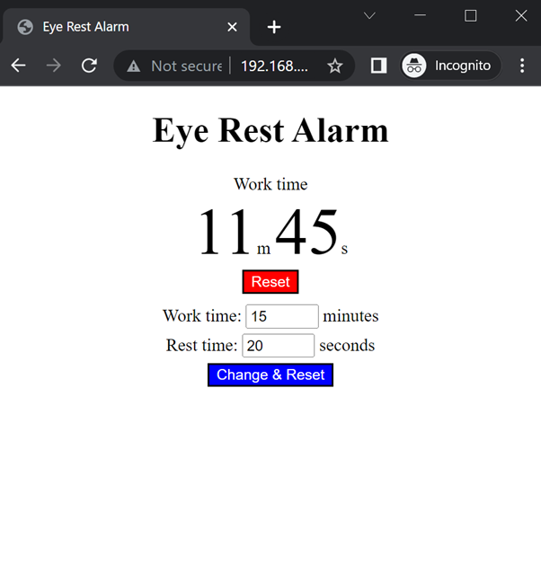
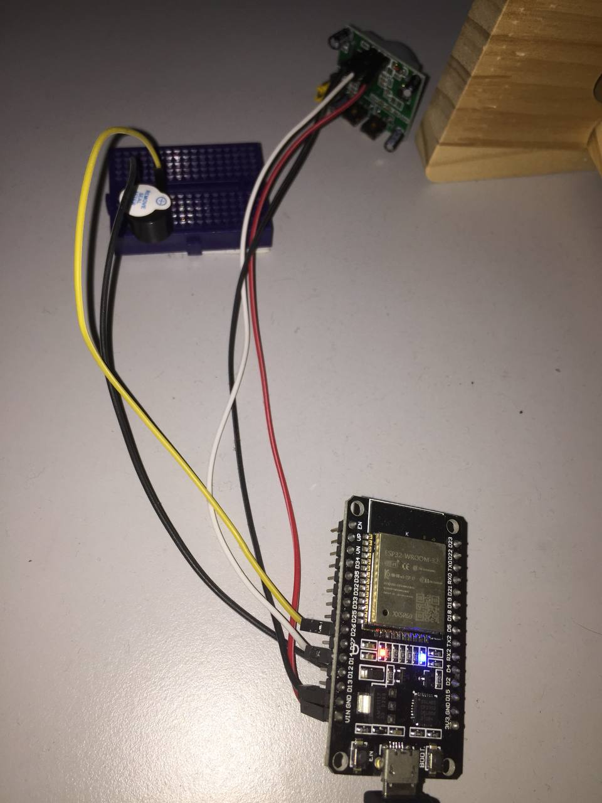

# Eye Rest Alarm

Eye Rest Alarm is an ESP32-enabled device to remind user to rest according to [20-20-20 rule](https://www.healthline.com/health/eye-health/20-20-20-rule) to prevent eye strain.

The ESP32 device will act as a timer and web server.
- Timer: The PIR sensor will be trigerred and count down the timer when the user is sitting in front of the desk and the buzzer will sound after 20 minutes. After that, a rest time of 20 seconds will be given.
- Web server: The user may view the remaining time, change the time configuration and reset the time by accessing the web server.

## Hardware

The parts needed are as follow:
- [ESP32 board](https://cytron.io/p-nodemcu-esp32)
- [Jumper wires](https://cytron.io/p-40-way-20cm-dupont-jumper-wire)
- [Active buzzer](https://cytron.io/p-buzzer-pcb-mount)
- [PIR sensor](https://cytron.io/p-low-cost-pir-sensor-module-hc-sr501)
- [Breadboard](https://cytron.io/p-breadboard-mini-170-holes-35mmx42mm) (optional)

## Pin configuration

- ESP32 VIN (assume close to 5V) to PIR sensor 5V
- ESP32 GND to PIR sensor GND
- ESP32 Pin 14 to PIR sensor OUT
- ESP32 Pin 26 to Buzzer +ve
- ESP32 GND to Buzzer -ve

Pin number configuration can be changed in the script.

## Software

Replace your Wi-Fi SSID and password in [boot.py](src/boot.py).

Flash ESP32 with all the files in [src](src).

Run [boot.py](src/boot.py) to get the ESP32 IP address and it can be accessed through your local area network (LAN).

